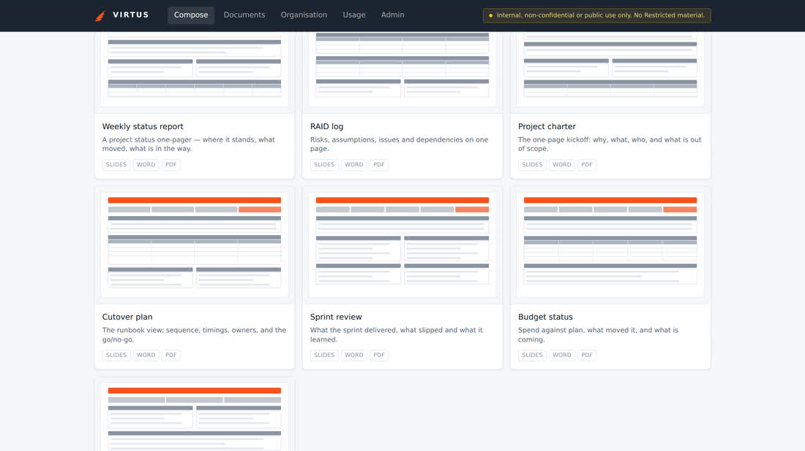
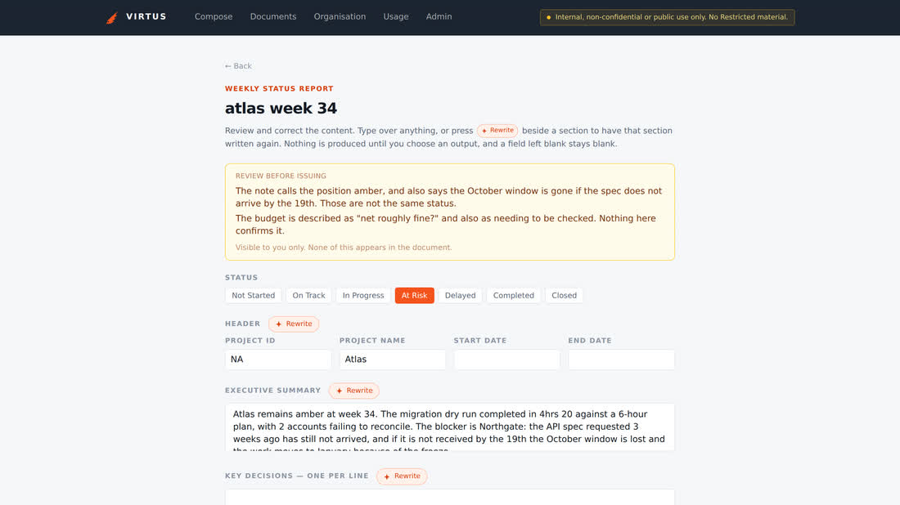
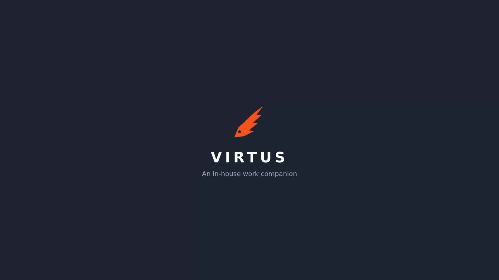
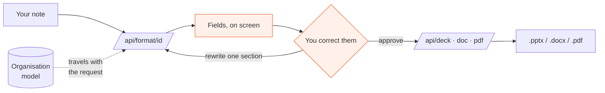
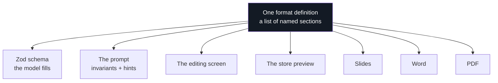
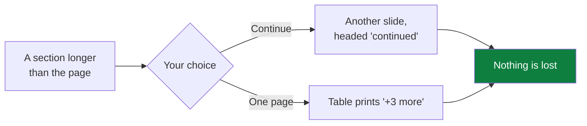
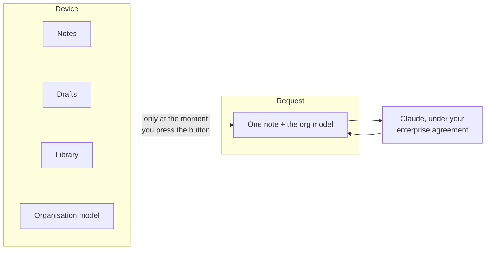

<div align="center">


</div>





*Every fact Virtus read out of your note, shown to you and editable — with the
places your own note contradicts itself flagged in the panel above. Nothing has
been produced yet.*

**Virtus turns the notes people already write into the documents their role
requires — and shows you every fact before it makes anything.**

An in-house work companion for an IT function. Twenty-six templates, three
outputs, and a rule it will not break: nothing reaches the document that was not
in what you wrote.

<div align="center">


<a href="https://raw.githubusercontent.com/Cosmius-SK/virtus/main/public/media/walkthrough.mp4">
  
</a>

**[Watch the walkthrough](
https://raw.githubusercontent.com/Cosmius-SK/virtus/main/public/media/walkthrough.mp4)** ·
**[Read the case](https://virtus-cosmius.vercel.app/about)** ·
**[See a document it made](https://virtus-cosmius.vercel.app/media/atlas-week-34.pptx)**

</div>

---

## The idea in thirty seconds

1. **Choose a template.** Twenty-six of them, each showing the shape of what it
   produces. Or describe what happened and let Virtus propose one.
2. **Put in what you know.** The template opens as boxes laid out the way the
   document is. Rough notes are expected; anything you do not have, you leave.
3. **Approve the facts.** Virtus reads it and shows you every field, editable,
   with contradictions in your own note flagged to you alone. Still no file.
4. **Take the file.** Slides, Word or PDF, in the firm's own colours.

## What leaves the building

The question everybody in an approval chain asks first.

| Stays on the device | Goes to the model |
|---|---|
| **Your notes and drafts.** In the browser's own storage. Never uploaded; no server here has a copy. | **The note you are turning into a document**, for the seconds the call takes — under your organisation's own Claude Enterprise agreement. |
| **Every document you have made.** The library is local, and re-issuing one in another format needs no model call at all. | **The organisation model, alongside that note** — the names, systems and house words, so the writing comes back already yours. |
| **The organisation model itself.** People, clients, systems, products, terminology. | **Nothing else, ever.** No third party, no analytics on content, and no silent fallback to a different provider. |

Calls run under the organisation's own enterprise agreement, which excludes
customer content from training. Virtus adds no second destination: one module
(`lib/ai/provider.ts`) knows the provider, the endpoint, the key and the model,
and if the configured one fails it stops rather than quietly trying another.

## How it fits together



The model is called once, to read. Producing the file is arithmetic — which is
why re-issuing an approved document in another format costs nothing.



Adding a template is adding an entry to `lib/formats/registry.ts` — or filling
in a form in the admin space. There is no renderer, prompt or screen to write,
which is why the twenty-sixth cost the same as the second.



A slide has an edge and a document does not. What will not fit is never dropped
in silence — a risk that was on your screen and is not in the file is how a risk
nobody was told about reaches a document everybody signed.



## What it does

| Documents | Getting it written | Making it yours |
|---|---|---|
| 26 templates in five categories | A store with a preview of each | An organisation model of people, clients, systems, products and terminology |
| Slides, Word and PDF from the same approved fields | A free-form conversation that proposes and waits for yes | Names corrected to their proper spelling before the model reads the note |
| One-pagers and multi-slide packs | Any single section rewritten, as often as you like | New names offered for learning under the finished document |
| A custom deck with no template, approved as an outline first | The whole document rewritten when the first pass missed the point | A house style read from a .pptx, .potx, .docx or .dotx your firm already uses |
| Seven slide shapes, each degrading rather than inventing | Contradictions in your own note flagged to you, never to the reader | Templates built in the admin space, exportable as a file |
| Type sized to its box; long sections continue rather than being cut | Six drafts kept, so an interruption costs nothing | A broadcast strip, changed without a deployment |

Plus: a shared passcode and a classification line on every screen; cost and
tokens measured per document rather than estimated; a local library that
re-issues any document with no further model call; Anthropic first-party,
Bedrock, Vertex or Foundry behind one module; and it works on a phone.

## What it costs to run

| | |
|---|---|
| **~2p** | a document, at current list prices |
| **~20s** | from note to reviewable fields |
| **£0** | to re-issue an existing document in another format |
| **0** | servers — it deploys as a single web app |

Every run records its model, token counts and elapsed time, and the total is on
the Usage screen. Nobody has to take the number on trust.

## Engineering notes

The three decisions that were actually hard.

**Formats are data, not code.** A format is a list of named sections with a hint
saying what belongs in each. One engine derives the schema, the prompt, the
editing screen, the store preview and all three renderers from that list. It is
why an admin screen that builds templates was a small job rather than a rewrite,
and why the shapes stayed at seven while the formats went to twenty-six.

**The palette is request-scoped.** A house style uploaded by an admin lives on
the device and travels with the render call. `BRAND` used to be a module
constant read in eighty-three places; assigning it before rendering would be a
race between two requests on one server, and the way that fails is one firm's
document coming out in another firm's colours — wrong in a way that still opens,
still looks finished, and has already been sent. It is scoped through
`AsyncLocalStorage` behind a proxy, so none of the eighty-three call sites
changed.

**The tests guard one rule, and it fails silently.** What the note did not say
must not reach the document. That failure produces a file that opens correctly
and is simply wrong, so every assertion is paired with a positive one — "the
output does not contain X" cannot tell absence from blindness, and four tests
here have passed their own mutation while looking perfectly fine.

## Running it

```bash
npm install
cp .env.example .env.local     # then add ANTHROPIC_API_KEY
npm run dev
npm run typecheck && npm run lint && npm test && npm run build
```

`docs/brief.md` is the handoff brief; section numbers in the code refer to it.
`CLAUDE.md` carries the conventions between sessions. `docs/test-notes.md` has a
raw note for every template. `docs/kit.md` says how the page and the video were
made.

Built in-house, for colleagues. Not for sale.
